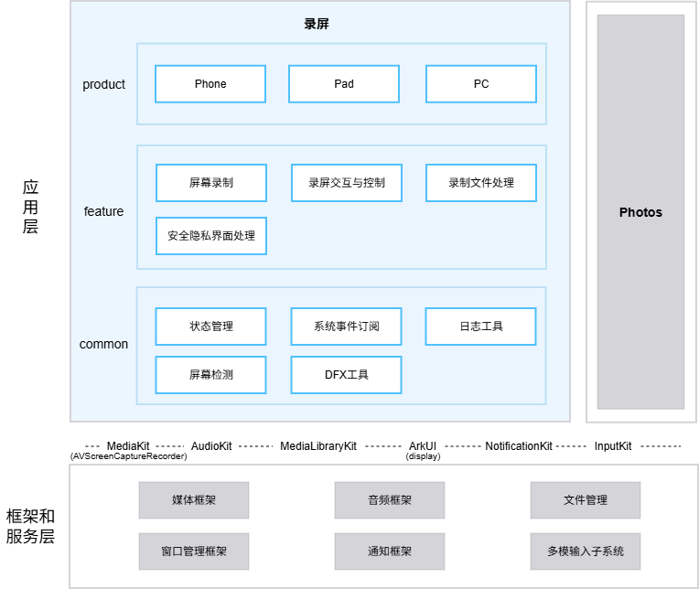

# 录屏（ScreenRecorder）

## 简介

**录屏**（包名：`com.ohos.screenrecorder`）是 OpenHarmony 中预置的 **系统应用**，通过 `@kit.MediaKit` 中的 `AVScreenCaptureRecorder` 类采集屏幕画面与音频，提供屏幕录制、录制交互控制、录制文件处理、安全隐私界面处理能力，并适配 Phone、Pad、PC 设备形态。

本应用为系统预置应用，用户可从控制中心快捷开关、快捷键触发录屏。

### 核心能力

**屏幕录制**
- 通过 `@kit.MediaKit` 的 `AVScreenCaptureRecorder` 类实现 H.264 视频编码与 AAC 音频编码采集，使用 `SCREEN_RECORD_PRESET_H264_AAC_MP4` 预设。
- 支持屏幕画面录制和触控轨迹录制，支持麦克风录制和媒体音录制两种音源。
- 通过 `RecordManager` / `PcRecordManager` 完成录制状态机管理，通过 `RecorderConfigInterface` 策略模式为不同设备提供差异化录制参数。

**录屏交互与控制**
- 通过 `ServiceExtensionAbility` 入口接收控制中心快捷开关事件、快捷键事件，触发录屏的启动与停止。
- 录制过程中呈现胶囊窗口（PC 浮动可拖拽窗口 / Phone & Pad 系统通知栏实况窗），包含计时器、麦克风开关、触控轨迹开关与停止按钮。
- 通过 `NotificationManager` 发布系统通知实况窗（`SlotType.LIVE_VIEW`），按钮回调由 `SystemLiveViewSubscriber` 处理。

**录制文件处理**
- 录制文件存储于系统媒体库，遵循 SVID 命名规范（`SVID_YYYYMMDD_HHmmss_N.mp4`）。
- 停止录制后以动画方式展示缩略图预览窗，点击跳转相册播放，支持拖拽关闭。
- 录制中断（锁屏、省电模式等）时通过通知提示用户。
- 通过 `WindowManager` / `PcWindowManager` 管理预览窗的缩放、模糊、透明度动画序列与拖拽交互。

**安全隐私界面处理**
- 安全隐私界面不允许录制：进入隐私界面会自动录制为黑屏，但不会停止录制，缩略图输出为黑屏图。
- 录制过程中检测到隐私界面时，通过 Toast 提示用户“当前界面涉及隐私内容，不会被录制”。
- 锁屏状态下拒绝录屏请求。
- OOBE（开机引导）阶段禁止触发录屏。


## 架构说明

录屏采用分层与模块化设计，按产品形态、业务特性与公共能力组织代码。




### 应用层分层设计

整体可划分为产品层、特性层、公共层：

| 层次   | 主要目录 / 组件 | 说明                                               |
|------| -------------- |--------------------------------------------------|
| 产品层 | `product/phone`、`product/pad`、`product/pc` | 支持 Phone、Pad、PC 形态，各产品以 `ServiceExtensionAbility` 为入口 |
| 特性层 | `feature/screenRecorder` | 录屏核心模块（包括：屏幕录制、交互控制、文件处理、隐私界面处理）                 |
| 公共层 | `common` | 状态管理、系统事件订阅、日志工具、屏幕检测、DFX工具                    |

**产品层模块说明**：

| 产品 | 关键入口与模块 | 说明 |
|------|-------------|------|
| phone | `Application/AbilityStage`、`ServiceExtAbility`、`ExtAbilityProxy`、`pages/` | 管理应用生命周期，接收控制中心、热键等外部 Want 事件并路由分发，承载胶囊、预览、控制中心等页面 |
| pad | `Application/AbilityStage`、`ServiceExtAbility`、`ExtAbilityProxy`、`pages/` | 与 phone 结构一致，适配 Pad 布局与折叠屏交互 |
| pc | `Application/AbilityStage`、`ServiceExtAbility`、`ExtAbilityProxy`、`pages/` | 与 phone 结构一致，扩展多屏蒙层选择、BC 扩展屏录制、可拖拽胶囊窗口 |

**特性层模块说明**：

| 核心能力   | 模块与关键类                                                                                               | 说明                      |
|--------|------------------------------------------------------------------------------------------------------|-------------------------|
| 屏幕录制   | `feature/screenRecorder`(RecordManager, PcRecordManager, RecorderFileManager, RecorderConfigInterface) | 录制状态机、录制状态机（PC）、文件资产管理、设备差异化配置         |
| 录屏交互与控制   | `feature/screenRecorder`(NotificationManager, Capsule, MicManager, ScreenRecorderControlPage)          | 系统通知实况窗、PC 浮动胶囊、麦克风控制、触控轨迹控制 |
| 录制文件处理 | `feature/screenRecorder`(RecorderFileManager, WindowManager, PcWindowManager, PicturePreviewer)                               | 文件资产管理、预览窗动画（Phone/Pad）、预览窗拖拽（PC）、跳转相册播放         |
| 安全隐私界面处理 | `feature/screenRecorder`(ExtAbilityProxy, RecorderUtil, FileWriteCheckWorker)                                                 | 锁屏/OOBE/省电模式拒绝触发、隐私界面处理、文件大小与空间监控 |

**公共层模块说明**：

| 公共模块 | 核心类 | 说明 |
|---------|-------|------|
| 状态管理 | `GlobalThisUtil`、`PreferenceUtils` | 跨 Ability 全局数据共享、偏好设置持久化 |
| 系统事件订阅 | `CommonEventUtil` | 系统公共事件订阅与分发 |
| 日志工具 | `LogUtil`、`EventReportUtil` | 统一日志输出、事件打点上报 |
| 屏幕检测 | `DisplayUtil` | 基于 `@kit.ArkUI` 的 `display` 接口，检测屏幕 DPI、方向（`getDefaultDisplaySync`）及折叠屏状态（`isFoldable` / `getFoldStatus` / `foldStatusChange`） |
| DFX工具 | `dfx/trace/` | 性能 Tracing 埋点，用于定位性能瓶颈 |

### 与其他应用的关系

| 项目          | 说明                                                      |
|-------------|---------------------------------------------------------|
| 是否允许其他应用调用  | 允许。`ServiceExtensionAbility` 声明 exported=true，外部应用可通过 Want 拉起         |
| 谁能调用        | 支持大桌面（`com.ohos.sceneboard`）拉起，系统快捷键通过多模输入子系统触发，以及 shell 命令调用（如 `hdc shell aa start -a ServiceExtAbility -b com.ohos.screenrecorder`）    |
| 什么时候能调用     | 应用安装后即可调用；OOBE 阶段、锁屏状态、省电模式下拒绝触发                           |
| 支持的 Want 参数 | 通过 `trigger_type` 参数区分触发来源：控制中心（`default_trigger_type`）、快捷键（`hot-key`）等 |
| 录制后相册跳转     | 通过 AbilityKit 的 StartAbility 拉起 `com.ohos.photos` 播放视频 |
| 跨进程服务       | 通过 `ServiceExtensionAbility` 提供服务，仅系统内部进程可调用  |

### 录制规格

| 规格项 | 说明 |
|--------|------|
| 视频编码 | H.264 (AVC) |
| 音频编码 | AAC（48000 Hz、单声道、96000 bps） |
| 封装格式 | MP4（`SCREEN_RECORD_PRESET_H264_AAC_MP4`） |
| 视频码率 | 10 Mbps |
| 分辨率 | 按设备差异化：Phone 原生分辨率（长边上限 1920 像素）；Pad 由 CCM 云控参数 `const.screenrecorder.resolution` 下发（默认设备原生，可配长边 1280 / 1920 像素，对应 720p/1080p）；PC 原生分辨率宽高向上取整为偶数，BC 录屏为 B+C 面合成尺寸 |
| 帧率 | 未显式设置，跟随系统默认（通常取决于编码器能力与系统策略） |
| 文件命名 | `SVID_YYYYMMDD_HHmmss_N.mp4` |
| 单文件上限 | 3 GB（超出自动新建文件继续录制） |
| 最低存储 | 128 MB 可用空间 |

## 编译构建

本工程为多模块 HAR + HAP 应用工程，使用 Hvigor 构建，产物为各设备形态的系统应用包。

### 环境要求
- OpenHarmony SDK（本工程 compileSdkVersion 为 "26.0.0"，compatibleSdkVersion / targetSdkVersion 为 23）
- DevEco Studio 或命令行 Hvigor 工具链
- 系统签名证书（见 `signature/`）

### 编译命令

在工程根目录执行：

```bash
# 使用 DevEco Studio 打开工程后执行 Build，或使用 hvigor 命令行
hvigorw assembleHap
```


## 录屏开发

录屏采用 **ArkTS** 语言开发，UI 基于 ArkUI Stage 模型。应用通过 `ServiceExtensionAbility` 接收外部触发事件，通过 `RecordManager` 驱动录制生命周期完成音视频采集，并通过 `WindowManager` / `NotificationManager` 管理录制中的胶囊与录制后的预览窗。开发可参考：[ArkUI 开发概述](https://gitcode.com/openharmony/docs/blob/master/zh-cn/application-dev/ui/arkts-ui-development-overview.md)

### 基于已有模块的开发

适用场景：对已有能力做功能定制，例如调整录制参数、修改录制流程、裁剪触发方式、调整 UI 交互等。

**对已有模块的功能修改与裁剪**

1. 明确改动点：按业务边界定位到 `product/phone`（入口与代理）、`feature/screenRecorder`（录制核心）或 `common`（公共能力）。

2. 修改录制参数：
   - Phone 配置位于 `feature/screenRecorder/src/main/ets/manager/config/PhoneRecorderConfigImpl.ets`
   - Pad 配置位于 `feature/screenRecorder/src/main/ets/manager/config/PadRecorderConfigImpl.ets`
   - PC 配置位于 `feature/screenRecorder/src/main/ets/manager/config/PcRecorderConfigImpl.ets`
   - 均实现 `RecorderConfigInterface` 接口，通过 `RecordManager.getInstance()` 按设备类型自动选择。

     例如，需修改视频码率，在各配置类中调整 `DEFAULT_VIDEO_BIT_RATE` 常量：
     ```typescript
     // PhoneRecorderConfigImpl.ets / PadRecorderConfigImpl.ets / PcRecorderConfigImpl.ets
     // 【修改点】将视频码率设置为 10000000，确保在编码器支持的范围内
     const DEFAULT_VIDEO_BIT_RATE = 10000000;

     // getVideoConfig() 中引用该常量
     const config: media.AVScreenCaptureRecordConfig = {
       videoBitrate: DEFAULT_VIDEO_BIT_RATE,  // → 10000000
       // ...
     };
     ```

3. 修改录制流程：
   - 核心流程入口位于 `feature/screenRecorder/src/main/ets/manager/RecordManager.ets`
   - `RecordManager.trigger()` → `startTrigger()` → `recordingNewVideoFile()` 为启动链路
   - `RecordManager.stop()` 为停止链路
   - PC 形态的差异逻辑位于 `feature/screenRecorder/src/main/ets/manager/PcRecordManager.ets`（继承 `RecordManager` 并覆写）

     例如，需在录制启动前新增自定义前置检查，可在 `RecordManager.startTrigger()` 中添加相关逻辑：
     ```typescript
     // RecordManager.ets — startTrigger 是录制启动入口
     public async startTrigger(displayId: number | undefined = undefined): Promise<void> {
       // 【新增自定义前置检查】
       if (!this.customPreCheck()) {
         return;
       }

       // 原有流程：检查存储空间 → 初始化录制器 → 创建视频文件 → startRecording
       const freeSpace = storageManager.getFreeSizeSync(context.filesDir);
       if (freeSpace <= MIN_FREE_SPACE_IN_BYTE) {
         RecorderToast.getInstance().showToast('storageFull_changeto_sdcard_new');
         return;
       }
       this.isRecording = true;
       await this.recordingNewVideoFile(true);
     }
     ```

4. 修改录制状态回调：
   - 状态回调位于 `RecordManager.setAVScreenCaptureCallback()` 内的 `stateChange` 与 `error` 监听。
   - `SCREENCAPTURE_STATE_STARTED`：录制启动成功，展示胶囊/通知。
   - `SCREENCAPTURE_STATE_STOPPED_BY_USER`：用户主动停止，释放资源。
   - `SCREENCAPTURE_STATE_INTERRUPTED_BY_OTHER`：被其他录制打断，自动停止。

     例如，需在录制被中断时增加自定义上报：
     ```typescript
     // RecordManager.ets — setAVScreenCaptureCallback() 中的 stateChange 分支
     case media.AVScreenCaptureStateCode.SCREENCAPTURE_STATE_INTERRUPTED_BY_OTHER:
       // 【新增自定义逻辑】记录中断时间与场景
       this.interruptTime = Date.now();
       this.reportInterruptEvent();
       // 原有流程：上报 → 停止 → 杀进程
       EventReportUtil.setStopType(StopRecordTriggerType.TRIGGERED_TYPE_BY_OTHER_RECORDING);
       await this.stop();
       RecorderUtil.postKillProcessMessage();
       break;
     ```

5. 修改 UI 组件：
   - PC 胶囊窗口位于 `feature/screenRecorder/src/main/ets/components/Capsule/index.ets`，布局结构为 `Flex` 容器，内含 `buildMicArea()`（麦克风区）+ 分隔线 + `buildTimerArea()`（计时区与停止按钮）。
   - 预览窗位于 `feature/screenRecorder/src/main/ets/components/PicturePreviewer/`
   - 蒙层位于 `feature/screenRecorder/src/main/ets/components/MaskPreviewer/`
   - 控制中心 UI 位于 `feature/screenRecorder/src/main/ets/components/ScreenRecorderControlPage/`
   - 业务代理入口位于 `product/phone/src/main/ets/proxy/ExtAbilityProxy.ets`（Phone/Pad）和 `product/pc/src/main/ets/proxy/ExtAbilityProxy.ets`（PC）

     例如，需统一 Phone 和 PC 预览窗的圆角半径，修改 `PicturePreviewer/index.ets` 的 `buildContent()`：
     ```typescript
     // PicturePreviewer/index.ets — 预览窗缩略图容器样式
     .borderRadius(CommonUtil.checkIfDeviceIsPhone()
       ? $r('app.float.default_corner_radius_s')    // Phone: 8vp
       : $r('app.float.pc_corner_radius_s'))        // PC: 4vp
     // 【修改点】统一为 Phone 的圆角值
     .borderRadius($r('app.float.default_corner_radius_s'))
     ```

常用修改入口：

| 目标             | 路径 |
|----------------| ---- |
| 录制生命周期           | `feature/screenRecorder/src/main/ets/manager/RecordManager.ets` |
| PC 录制扩展            | `feature/screenRecorder/src/main/ets/manager/PcRecordManager.ets` |
| 录制配置 (Phone)           | `feature/screenRecorder/src/main/ets/manager/config/PhoneRecorderConfigImpl.ets` |
| 录制配置 (Pad)          | `feature/screenRecorder/src/main/ets/manager/config/PadRecorderConfigImpl.ets` |
| 录制配置 (PC)         | `feature/screenRecorder/src/main/ets/manager/config/PcRecorderConfigImpl.ets` |
| 胶囊 UI (PC) | `feature/screenRecorder/src/main/ets/components/Capsule/` |
| 预览窗 UI           | `feature/screenRecorder/src/main/ets/components/PicturePreviewer/` |
| 业务代理入口 (Phone/Pad)         | `product/phone/src/main/ets/proxy/ExtAbilityProxy.ets` |
| 业务代理入口 (PC) | `product/pc/src/main/ets/proxy/ExtAbilityProxy.ets` |

### 新特性能力的开发

适用场景：新增录制相关能力、扩展胶囊形态、补充差异化交互或适配新设备形态。

> **说明**：当前工程采用 `product + feature + common` 多模块结构，产品入口主要在 `product/phone`、`product/pad`、`product/pc`。新能力一般按现有分层扩展；若新增产品形态 HAP，可在 `product/` 下增加对应目录并在 `build-profile.json5` 中注册。

**场景示例：录制中途切换麦克风音源**

以下以"录制过程中开启/关闭麦克风"为例，展示新增录制音源切换能力的完整开发路径：

1. 在 `feature/screenRecorder/src/main/ets/manager/` 中新增 `MicManager.ets`，封装麦克风控制逻辑：通过 `AVScreenCaptureRecorder.setMicEnabled()` 切换麦克风开关，通过 `PreferenceUtils` 持久化麦克风状态，调用 `EventReportUtil` 上报切换事件。麦克风被占用时（`SCREENCAPTURE_STATE_MIC_UNAVAILABLE`）禁用切换并 Toast 提示。

2. 在 `feature/screenRecorder/src/main/ets/components/Capsule/index.ets` 的胶囊窗口中新增麦克风按钮区域（`buildMicArea`），显示麦克风开关图标与文字，点击触发 `MicManager.setMicEnabled()`，并根据当前麦克风状态切换图标高亮/置灰。

3. 在 `RecordManager.setAVScreenCaptureCallback()` 中新增 `SCREENCAPTURE_STATE_MIC_UNAVAILABLE` 状态处理：标记麦克风不可用，刷新胶囊 UI。

4. PC 端额外通过 `@kit.AudioKit` 监听系统静音状态（`micStateChange`），用户按键盘物理静音键时同步关闭录屏麦克风。

5. 在 `product/phone/src/ohosTest` 中新增 `MicManager.test.ets` 测试用例。

事件入口（`ServiceExtAbility`）典型处理：

```typescript
// ServiceExtAbility：接收外部触发事件，创建 Proxy 并注册生命周期
export default class ServiceExtAbility extends ServiceExtensionAbility {
  private extAbilityProxy: ExtAbilityProxy;

  onCreate(want: Want): void {
    this.extAbilityProxy = new ExtAbilityProxy(this.context);
    this.extAbilityProxy.onCreate();
  }

  onRequest(want: Want, startId: number): void {
    this.extAbilityProxy.onRequest(want, undefined, false);
  }

  onDestroy(): void {
    this.extAbilityProxy.onDestroy();
  }
}
```

若需新增独立页面：
1. 在对应模块 `pages/` 下新增页面文件；
2. 在 `resources/base/profile/main_pages.json` 中声明；
3. 由 Want 路由或 `WindowManager` 拉起。

## 目录

```text
screenrecorder
├── AppScope                                 # 应用级配置与多语言资源
│   ├── app.json5                            # bundleName、版本号等
│   └── resources/                           # 全局字符串 / 图标等资源
├── common                                   # 公共能力层
│   └── src/main/ets
│       ├── util/                            # 通用工具，包括日志、打点、偏好设置、全局状态等
│       └── dfx/trace/                       # 性能 Trace
├── docs
│   └── figures/                             # 架构图
├── feature                                  # 特性层
│   └── screenRecorder/                      # 录屏核心业务
│       └── src/main/ets
│           ├── manager/                     # 录制 / 文件 / 窗口 / 麦克风 / 通知等控制器
│           │   └── config/                  # 设备录制配置策略 (Phone/Pad/PC)
│           ├── components/                  # 页面组件，包括胶囊、预览窗、蒙层等
│           ├── util/                        # 工具类（进程管理、省电模式）
│           └── worker/                      # Worker 后台线程（文件监控、时间戳）
├── product                                  # 产品层
│   ├── phone/                               # Phone 形态 HAP
│   │   └── src/main/ets/
│   │       ├── Application/                 # AbilityStage
│   │       ├── Ability/                     # ServiceExtensionAbility / UIAbility
│   │       ├── pages/                       # 页面（胶囊页、预览页、控制页等）
│   │       ├── proxy/                       # ExtAbilityProxy 业务代理
│   │       └── serviceExtAbility/           # ServiceExtensionAbility 入口
│   ├── pad/                                 # Pad 形态 HAP
│   └── pc/                                  # PC 形态 HAP
├── signature                                # 签名证书与 profile
├── bundle.json                              # 部件描述文件
├── build-profile.json5                      # 工程级配置
├── oh-package.json5
├── build.sh                                 # CI 构建脚本
├── OAT.xml                                  # 开源合规审计
├── LICENSE
├── README.md                                # 中文说明文档
└── README_en.md                             # 英文说明文档
```

## 约束

- **语言版本**：ArkTS
- **运行形态**：系统预置应用（`com.ohos.screenrecorder`），通过 `ServiceExtensionAbility` 进程运行，依赖音视频采集、媒体库、窗口管理、通知等系统能力
- **设备类型**：Phone、Pad、PC（见各产品 `module.json5`）
- **权限**：录屏所需的主要权限如下（见各产品 `module.json5`）

  | 权限 | 授权方式 | 使用场景 |
  |------|---------|--------|
  | ohos.permission.CAPTURE_SCREEN | 系统授权 | 屏幕录制音视频采集 |
  | ohos.permission.MICROPHONE | 系统授权 | 录制时采集麦克风音频 |
  | ohos.permission.SET_UNREMOVABLE_NOTIFICATION | 系统授权 | 录制中显示不可移除通知 |
  | ohos.permission.SYSTEM_FLOAT_WINDOW | 系统授权 | PC 浮动胶囊窗口创建 |
  | ohos.permission.MANAGE_SECURE_SETTINGS | 系统授权 | 系统设置项读写（触控轨迹等） |
  | ohos.permission.WRITE_IMAGEVIDEO | 系统授权 | 将录制文件写入媒体库 |
  | ohos.permission.START_ABILITIES_FROM_BACKGROUND | 系统授权 | 后台拉起 Ability |

- **屏幕约束**：
  - 多显示屏场景下，开启录屏后所有屏幕均显示蒙灰，用户可自行选择录制哪个屏幕。
  - 外接显示屏电源断开，不影响录制，继续进行。
  - 拔掉显示屏与主机的连线（触发 display remove），正在录制该屏时停止录屏。
  - 折叠屏折叠或展开时，停止录屏。

- **异常场景处理**：
  - 存储空间不足（< 128 MB）：拒绝启动录制，提示用户清理空间；录制中空间不足则自动停止录制。
  - 单文件超 3 GB：自动新建文件继续录制。
  - 系统内存不足或过热：由系统底层低内存/温控机制查杀录屏进程。
  - 录制服务异常（`AVERR_SERVICE_DIED`）：释放资源、停止录制、终止进程。

- **形态适配**：不同设备形态会改变录制分辨率与窗口布局，修改 UI 时需覆盖多形态验证

## 参与贡献

欢迎广大开发者贡献代码、文档等，具体的贡献流程和方式请参见[参与贡献](https://gitcode.com/openharmony/docs/blob/master/zh-cn/contribute/%E5%8F%82%E4%B8%8E%E8%B4%A1%E7%8C%AE.md)。
