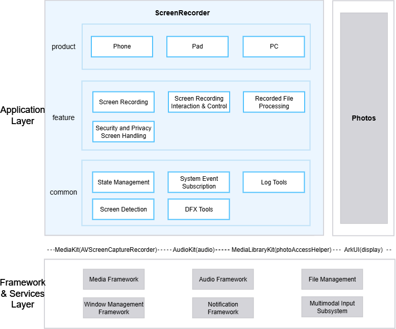

# Screen Recorder

## Introduction

**Screen Recorder** (package name: `com.ohos.screenrecorder`) is a pre-installed **system application** in OpenHarmony that captures screen content and audio via the `AVScreenCaptureRecorder` class from `@kit.MediaKit`, providing screen recording, recording interaction and control, recording file processing, and security & privacy screen handling capabilities across phones, tablets, and PCs.

This application is a pre-installed system app. Users can trigger recording via Control Center quick toggles and keyboard shortcuts.

### Core Capabilities

**Screen Recording**
- H.264 video encoding and AAC audio encoding via the `AVScreenCaptureRecorder` class from `@kit.MediaKit`, using the `SCREEN_RECORD_PRESET_H264_AAC_MP4` preset.
- Supports screen capture and touch-trajectory recording, with two audio sources: microphone and system media audio.
- Uses `RecordManager` / `PcRecordManager` for recording state machine management, and `RecorderConfigInterface` strategy pattern for device-specific recording parameters.

**Recording Interaction and Control**
- Receives Control Center quick-toggle and hotkey events through the `ServiceExtensionAbility` entry point, triggering recording start and stop.
- Displays a capsule window during recording (floating draggable window on PC / system notification Live View on Phone & Pad), including a timer, microphone toggle, touch-trajectory toggle, and stop button.
- Publishes system notification Live Views (`SlotType.LIVE_VIEW`) through `NotificationManager`; button callbacks are handled by `SystemLiveViewSubscriber`.

**Recording File Processing**
- Recording files are stored in the system media library, following the SVID naming convention (`SVID_YYYYMMDD_HHmmss_N.mp4`).
- After recording stops, displays a thumbnail preview window with animation. Tap to open the album for playback; drag to dismiss.
- Notifies the user when a recording is interrupted (screen lock, power saving mode, etc.).
- Uses `WindowManager` / `PcWindowManager` to manage the preview window's scale, blur, and opacity animation sequences and drag interaction.

**Security & Privacy Screen Handling**
- Privacy interface recording: Entering a privacy interface automatically records a black screen without stopping the recording; the thumbnail output is a black screen image.
- When a privacy interface is detected during recording, alerts the user via a Toast: "This screen contains private content and won't be recorded."
- Rejects recording requests when the screen is locked.
- Prohibits recording triggers during the OOBE (out-of-box experience) phase.

## Architecture

Screen Recorder adopts a layered and modular design, organizing code by product form, business features, and common capabilities.



### Application Layer Design

The application is divided into three layers:

| Layer   | Primary Directories / Components | Description                                                                                              |
|------| -------------- |----------------------------------------------------------------------------------------------------------|
| Product | `product/phone`, `product/pad`, `product/pc` | Supports phone, tablet, and PC forms; each product uses `ServiceExtensionAbility` as the entry point     |
| Feature | `feature/screenRecorder` | Core recording module(including:Screen Recording, Interaction & Control, File Processing, Privacy Screen Handling) |
| Common | `common` | State management, system event subscription, logging, screen detection, DFX tools                                 |

**Product Layer Module Details**:

| Product | Key Entry & Modules | Description |
|---------|-------------------|-------------|
| phone | `Application/AbilityStage`, `ServiceExtAbility`, `ExtAbilityProxy`, `pages/` | Manages app lifecycle, receives Control Center/hotkey Want events and routes them, hosts capsule/preview/control center pages |
| pad | `Application/AbilityStage`, `ServiceExtAbility`, `ExtAbilityProxy`, `pages/` | Same structure as phone, adapted for tablet layout and foldable screen interaction |
| pc | `Application/AbilityStage`, `ServiceExtAbility`, `ExtAbilityProxy`, `pages/` | Same structure as phone, with extended multi-screen mask selection, BC screen recording, and draggable capsule window |

**Feature Layer Module Details**:

| Core Capability   | Modules & Key Classes                                                                                  | Description                      |
|--------|--------------------------------------------------------------------------------------------------------|-------------------------|
| Screen Recording   | `feature/screenRecorder`(RecordManager, PcRecordManager, RecorderFileManager, RecorderConfigInterface) | Recording state machine, recording state machine (PC), file asset management, device-specific configuration         |
| Recording Interaction & Control   | `feature/screenRecorder`(NotificationManager, Capsule, MicManager, ScreenRecorderControlPage)                                   | System notification Live View, PC floating capsule, microphone control, touch-trajectory control |
| Recording File Processing | `feature/screenRecorder`(RecorderFileManager, WindowManager, PcWindowManager, PicturePreviewer)                                 | File asset management, preview animation (Phone/Pad), preview drag (PC), jump to album for playback         |
| Security & Privacy Screen Handling | `feature/screenRecorder`(ExtAbilityProxy, RecorderUtil, FileWriteCheckWorker)                                                   | Lock screen/OOBE/power saving mode rejection, privacy interface handling, file size and space monitoring |

**Common Layer Module Details**:

| Common Module | Core Classes | Description |
|-------------|-------------|-------------|
| State Management | `GlobalThisUtil`, `PreferenceUtils` | Cross-Ability global data sharing, preference persistence |
| System Event Subscription | `CommonEventUtil` | System common event subscription and distribution |
| Logging | `LogUtil`, `EventReportUtil` | Unified logging, event reporting |
| Screen Detection | `DisplayUtil` | Screen DPI, orientation, fold status, display mode detection |
| DFX Tools | `dfx/trace/` | Performance tracing for identifying bottlenecks |

### Relationship with Other Applications

| Item          | Description                                                      |
|-------------|---------------------------------------------------------|
| Can other apps invoke it?  | Yes. `ServiceExtensionAbility` declares exported=true; external apps can launch via Want         |
| Who can invoke it?        | Supports launching by SceneBoard (`com.ohos.sceneboard`), system hotkeys via multimodal input subsystem, and shell commands (e.g. `hdc shell aa start -a ServiceExtAbility -b com.ohos.screenrecorder`)    |
| When can it be invoked?     | Can be invoked after installation; triggers are rejected during OOBE, lock screen, and power saving mode                           |
| Supported Want parameters | Trigger source is distinguished by the `trigger_type` parameter: Control Center (`default_trigger_type`), hotkey (`hot-key`), etc. |
| Post-recording album jump     | Launches `com.ohos.photos` via AbilityKit's StartAbility for video playback |
| Cross-process service       | Provides service via `ServiceExtensionAbility`; callable only by internal system processes  |

### Recording Specifications

| Spec | Description |
|------|-------------|
| Video Codec | H.264 (AVC) |
| Audio Codec | AAC (48000 Hz, mono, 96000 bps) |
| Container | MP4 (`SCREEN_RECORD_PRESET_H264_AAC_MP4`) |
| Video Bitrate | 10 Mbps |
| Resolution | Device-specific: Phone uses native resolution (max side capped at 1920 pixels); Pad is controlled by CCM parameter `const.screenrecorder.resolution` (defaults to device native, configurable to a max side of 1280 / 1920 pixels, i.e. 720p/1080p); PC uses native resolution with width and height rounded up to even numbers, BC recording uses combined B+C dimensions |
| Frame Rate | Not explicitly set; follows system default (depends on encoder capability and system policy) |
| File Naming | `SVID_YYYYMMDD_HHmmss_N.mp4` |
| Max File Size | 3 GB (auto-creates a new file to continue recording) |
| Min Storage | 128 MB free space |

## Build

This project is a multi-module HAR + HAP application project built with Hvigor, producing per-device-form system application packages.

### Environment Requirements
- OpenHarmony SDK (compileSdkVersion: "26.0.0", compatibleSdkVersion / targetSdkVersion: 23)
- DevEco Studio or command-line Hvigor toolchain
- System signing certificates (see `signature/`)

### Build Commands

Run in the project root directory:

```bash
# Open the project with DevEco Studio and execute Build, or use the Hvigor command line
hvigorw assembleHap
```

## Screen Recorder Development

Screen Recorder is developed in **ArkTS**, with UI based on the ArkUI Stage model. The application receives external trigger events through `ServiceExtensionAbility`, drives the recording lifecycle through `RecordManager` to complete audio/video capture, and manages the in-recording capsule and post-recording preview window via `WindowManager` / `NotificationManager`. See the [ArkUI Development Overview](https://gitcode.com/openharmony/docs/blob/master/zh-cn/application-dev/ui/arkts-ui-development-overview.md) for reference.

### Developing on Existing Modules

Applicable scenarios: customizing existing capabilities, such as adjusting recording parameters, modifying the recording flow, removing trigger methods, or adjusting UI interactions.

**Modifying and Trimming Existing Modules**

1. Identify the change target by business boundary: `product/phone` (entry and proxy), `feature/screenRecorder` (recording core), or `common` (common capabilities).

2. Modifying recording parameters:
   - Phone configuration is in `feature/screenRecorder/src/main/ets/manager/config/PhoneRecorderConfigImpl.ets`
   - Tablet configuration is in `feature/screenRecorder/src/main/ets/manager/config/PadRecorderConfigImpl.ets`
   - PC configuration is in `feature/screenRecorder/src/main/ets/manager/config/PcRecorderConfigImpl.ets`
   - All implement the `RecorderConfigInterface` interface and are automatically selected by device type via `RecordManager.getInstance()`.

     For example, to change the video bitrate, modify the `DEFAULT_VIDEO_BIT_RATE` constant in each config class:
     ```typescript
     // PhoneRecorderConfigImpl.ets / PadRecorderConfigImpl.ets / PcRecorderConfigImpl.ets
     // [Modification] Set video bitrate to 10000000 to stay within encoder limits
     const DEFAULT_VIDEO_BIT_RATE = 10000000;

     // Referenced in getVideoConfig()
     const config: media.AVScreenCaptureRecordConfig = {
       videoBitrate: DEFAULT_VIDEO_BIT_RATE,  // → 10000000
       // ...
     };
     ```

3. Modifying the recording flow:
   - Core flow entry is in `feature/screenRecorder/src/main/ets/manager/RecordManager.ets`
   - `RecordManager.trigger()` → `startTrigger()` → `recordingNewVideoFile()` is the startup chain
   - `RecordManager.stop()` is the stop chain
   - PC-specific logic is in `feature/screenRecorder/src/main/ets/manager/PcRecordManager.ets` (which extends `RecordManager` and overrides its behavior)

     For example, to add a custom pre-check before recording starts, modify `RecordManager.startTrigger()`:
     ```typescript
     // RecordManager.ets — startTrigger is the recording startup entry
     public async startTrigger(displayId: number | undefined = undefined): Promise<void> {
       // [New custom pre-check]
       if (!this.customPreCheck()) {
         return;
       }

       // Original flow: check storage → init recorder → create video file → startRecording
       const freeSpace = storageManager.getFreeSizeSync(context.filesDir);
       if (freeSpace <= MIN_FREE_SPACE_IN_BYTE) {
         RecorderToast.getInstance().showToast('storageFull_changeto_sdcard_new');
         return;
       }
       this.isRecording = true;
       await this.recordingNewVideoFile(true);
     }
     ```

4. Modifying recording state callbacks:
   - State callbacks are in the `stateChange` and `error` listeners within `RecordManager.setAVScreenCaptureCallback()`.
   - `SCREENCAPTURE_STATE_STARTED`: Recording started successfully, show capsule/notification.
   - `SCREENCAPTURE_STATE_STOPPED_BY_USER`: User-initiated stop, release resources.
   - `SCREENCAPTURE_STATE_INTERRUPTED_BY_OTHER`: Interrupted by another recording, auto-stop.

     For example, to add custom reporting when recording is interrupted:
     ```typescript
     // RecordManager.ets — stateChange branch in setAVScreenCaptureCallback()
     case media.AVScreenCaptureStateCode.SCREENCAPTURE_STATE_INTERRUPTED_BY_OTHER:
       // [New custom logic] Record interrupt time and scenario
       this.interruptTime = Date.now();
       this.reportInterruptEvent();
       // Original flow: report → stop → kill process
       EventReportUtil.setStopType(StopRecordTriggerType.TRIGGERED_TYPE_BY_OTHER_RECORDING);
       await this.stop();
       RecorderUtil.postKillProcessMessage();
       break;
     ```

5. Modifying UI components:
   - PC capsule window is in `feature/screenRecorder/src/main/ets/components/Capsule/index.ets`, with a layout structure of a `Flex` container containing `buildMicArea()` (microphone area) + divider + `buildTimerArea()` (timer area and stop button).
   - Preview window is in `feature/screenRecorder/src/main/ets/components/PicturePreviewer/`
   - Mask window is in `feature/screenRecorder/src/main/ets/components/MaskPreviewer/`
   - Control Center UI is in `feature/screenRecorder/src/main/ets/components/ScreenRecorderControlPage/`
   - Business proxy entry is in `product/phone/src/main/ets/proxy/ExtAbilityProxy.ets` (Phone/Pad) and `product/pc/src/main/ets/proxy/ExtAbilityProxy.ets` (PC)

     For example, to unify the corner radius of Phone and PC preview windows, modify `buildContent()` in `PicturePreviewer/index.ets`:
     ```typescript
     // PicturePreviewer/index.ets — preview thumbnail container style
     .borderRadius(CommonUtil.checkIfDeviceIsPhone()
       ? $r('app.float.default_corner_radius_s')    // Phone: 8vp
       : $r('app.float.pc_corner_radius_s'))        // PC: 4vp
     // [Modification] Unify both to Phone corner radius
     .borderRadius($r('app.float.default_corner_radius_s'))
     ```

Common modification entry points:

| Target             | Path |
|----------------| ---- |
| Recording lifecycle           | `feature/screenRecorder/src/main/ets/manager/RecordManager.ets` |
| PC recording extension            | `feature/screenRecorder/src/main/ets/manager/PcRecordManager.ets` |
| Recording config (Phone)           | `feature/screenRecorder/src/main/ets/manager/config/PhoneRecorderConfigImpl.ets` |
| Recording config (Pad)          | `feature/screenRecorder/src/main/ets/manager/config/PadRecorderConfigImpl.ets` |
| Recording config (PC)         | `feature/screenRecorder/src/main/ets/manager/config/PcRecorderConfigImpl.ets` |
| Capsule UI (PC) | `feature/screenRecorder/src/main/ets/components/Capsule/` |
| Preview window UI           | `feature/screenRecorder/src/main/ets/components/PicturePreviewer/` |
| Business proxy entry (Phone/Pad)         | `product/phone/src/main/ets/proxy/ExtAbilityProxy.ets` |
| Business proxy entry (PC) | `product/pc/src/main/ets/proxy/ExtAbilityProxy.ets` |

### Developing New Feature Capabilities

Applicable scenarios: adding new recording capabilities, extending capsule forms, supplementing differentiated interactions, or adapting to new device forms.

> **Note**: This project uses a `product + feature + common` multi-module structure, with product entry points mainly in `product/phone`, `product/pad`, and `product/pc`. New capabilities are generally extended within the existing layering; if a new product form HAP is needed, add the corresponding directory under `product/` and register it in `build-profile.json5`.

**Scenario Example: Switching Microphone Audio Source Mid-Recording**

The following uses "enabling/disabling the microphone during recording" as an example to demonstrate the complete development path for adding an audio source switching capability:

1. Add `MicManager.ets` in `feature/screenRecorder/src/main/ets/manager/` to encapsulate microphone control logic: toggling via `AVScreenCaptureRecorder.setMicEnabled()`, persisting microphone state via `PreferenceUtils`, and reporting switch events via `EventReportUtil`. When the microphone is occupied (`SCREENCAPTURE_STATE_MIC_UNAVAILABLE`), disable switching and show a Toast.

2. Add a microphone button area (`buildMicArea`) to the capsule window in `feature/screenRecorder/src/main/ets/components/Capsule/index.ets`, displaying a microphone icon and label. Tapping triggers `MicManager.setMicEnabled()`, with the icon switching between highlighted and grayed-out states based on current microphone status.

3. Add `SCREENCAPTURE_STATE_MIC_UNAVAILABLE` state handling in `RecordManager.setAVScreenCaptureCallback()`: mark the microphone as unavailable and refresh the capsule UI.

4. On PC, additionally monitor the system mute state via `@kit.AudioKit` (`micStateChange`). When the user presses the physical keyboard mute key, synchronize by disabling the recording microphone.

5. Add `MicManager.test.ets` test cases in `product/phone/src/ohosTest`.

Event entry (`ServiceExtAbility`) typical handling:

```typescript
// ServiceExtAbility: receives external trigger events, creates Proxy and registers lifecycle
export default class ServiceExtAbility extends ServiceExtensionAbility {
  private extAbilityProxy: ExtAbilityProxy;

  onCreate(want: Want): void {
    this.extAbilityProxy = new ExtAbilityProxy(this.context);
    this.extAbilityProxy.onCreate();
  }

  onRequest(want: Want, startId: number): void {
    this.extAbilityProxy.onRequest(want, undefined, false);
  }

  onDestroy(): void {
    this.extAbilityProxy.onDestroy();
  }
}
```

To add a new standalone page:
1. Add a new page file under the corresponding module's `pages/` directory;
2. Declare it in `resources/base/profile/main_pages.json`;
3. Launch it via Want routing or `WindowManager`.

## Directory Structure

```text
screenrecorder
├── AppScope                                 # Application-level configuration & i18n resources
│   ├── app.json5                            # bundleName, version, etc.
│   └── resources/                           # Global strings / icons
├── common                                   # Common layer
│   └── src/main/ets
│       ├── util/                            # Common utilities: logging, event reporting, preferences, global state, etc.
│       └── dfx/trace/                       # Performance tracing
├── docs
│   └── figures/                             # Architecture diagrams
├── feature                                  # Feature layer
│   └── screenRecorder/                      # Core recording business
│       └── src/main/ets
│           ├── manager/                     # Recording / file / window / mic / notification controllers
│           │   └── config/                  # Device recording config strategies (Phone/Pad/PC)
│           ├── components/                  # Page components: capsule, preview, mask, etc.
│           ├── util/                        # Utilities (process management, power saving)
│           └── worker/                      # Worker background threads (file monitoring, timestamp)
├── product                                  # Product layer
│   ├── phone/                               # Phone form HAP
│   │   └── src/main/ets/
│   │       ├── Application/                 # AbilityStage
│   │       ├── Ability/                     # ServiceExtensionAbility / UIAbility
│   │       ├── pages/                       # Pages (capsule, preview, control, etc.)
│   │       ├── proxy/                       # ExtAbilityProxy business proxy
│   │       └── serviceExtAbility/           # ServiceExtensionAbility entry
│   ├── pad/                                 # Tablet form HAP
│   └── pc/                                  # PC form HAP
├── signature                                # Signing certificates & profile
├── bundle.json                              # Component descriptor
├── build-profile.json5                      # Project-level config
├── oh-package.json5
├── build.sh                                 # CI build script
├── OAT.xml                                  # Open source compliance audit
├── LICENSE
├── README.md                                # Chinese documentation
└── README_en.md                             # English documentation
```

## Constraints

- **Language**: ArkTS
- **Runtime form**: Pre-installed system application (`com.ohos.screenrecorder`), running in a `ServiceExtensionAbility` process, depending on audio/video capture, media library, window management, notification, and other system capabilities
- **Device types**: Phone, Pad, PC (see each product's `module.json5`)
- **Permissions**: Primary permissions required by Screen Recorder (see each product's `module.json5`)

  | Permission | Authorization | Use Case |
  |------|---------|--------|
  | ohos.permission.CAPTURE_SCREEN | System grant | Screen recording audio/video capture |
  | ohos.permission.MICROPHONE | System grant | Microphone audio capture during recording |
  | ohos.permission.SET_UNREMOVABLE_NOTIFICATION | System grant | Display non-removable notification during recording |
  | ohos.permission.SYSTEM_FLOAT_WINDOW | System grant | PC floating capsule window creation |
  | ohos.permission.MANAGE_SECURE_SETTINGS | System grant | Read/write system settings (touch-trajectory, etc.) |
  | ohos.permission.WRITE_IMAGEVIDEO | System grant | Write recording files to media library |
  | ohos.permission.START_ABILITIES_FROM_BACKGROUND | System grant | Launch Ability from background |

- **Screen Constraints**:
  - In multi-display scenarios, all screens display a gray mask overlay when recording is triggered, allowing the user to select which screen to record.
  - Turning off the external display's power does not affect recording; recording continues.
  - Unplugging the display cable from the host (triggering display remove) stops recording when the display being recorded is removed.
  - Foldable screen folding or unfolding stops recording.

- **Abnormal Scenario Handling**:
  - Insufficient storage (< 128 MB): reject recording start and prompt the user to free space; stop recording automatically if space runs low during recording.
  - Single file exceeds 3 GB: automatically create a new file to continue recording.
  - Low system memory or overheating: the recording process is killed by the underlying low-memory killer or thermal control mechanism.
  - Recording service error (`AVERR_SERVICE_DIED`): release resources, stop recording, and terminate the process.

- **Form factor adaptation**: Different device forms may change recording resolution and window layout. UI modifications must be verified across multiple form factors.

## Contributing

Contributions of code, documentation, and more are welcome. For specific contribution processes and guidelines, see [Contributing](https://gitcode.com/openharmony/docs/blob/master/zh-cn/contribute/%E5%8F%82%E4%B8%8E%E8%B4%A1%E7%8C%AE.md).
